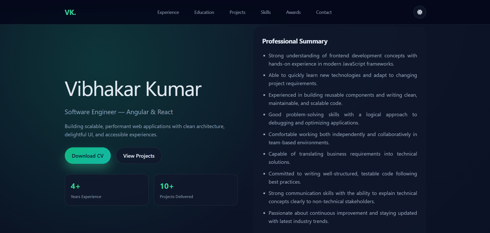

# Portfolio - Vibhakar

A modern, responsive personal portfolio built with Angular 17. It highlights projects, skills, education, experience, awards, and contact information with a clean, fast UI.

## Sections

- Hero / Home
- About / Education
- Experience
- Projects
- Skills
- Certificates
- Awards
- Contact

## Tech Stack

- Angular 17 (Standalone APIs)
- TypeScript
- SCSS + Tailwind CSS
- Font Awesome

## Getting Started

1) Install dependencies: `npm install`
2) Run the app: `npm start`
3) Open `http://localhost:4200`

## Scripts

- `npm start` — start dev server
- `npm run build` — build production assets
- `npm run watch` — build in watch mode
- `npm test` — run unit tests
- `npm run serve:ssr:my-portfolio` — serve SSR build

## Project Structure

- [src/app/core/layout](src/app/core/layout) — header/footer layout
- [src/app/core/pages](src/app/core/pages) — page sections (hero, skills, projects, etc.)
- [src/app/core/services](src/app/core/services) — shared services (theme, etc.)
- [src/assets](src/assets) — static assets

## Customization

- Update content and data in the page components under [src/app/core/pages](src/app/core/pages).
- Adjust global styles in [src/styles.scss](src/styles.scss).
- Tailwind config: [tailwind.config.ts](tailwind.config.ts).

## Deployment

Deployed on GitHub Pages: https://iamvibhakar.github.io/portfolio_vibhakar

Build with `npm run build` and deploy the contents of `dist/`.

## License

Copyright © 2026 Vibhakar Kumar — https://www.linkedin.com/in/vibhakarkumar/
