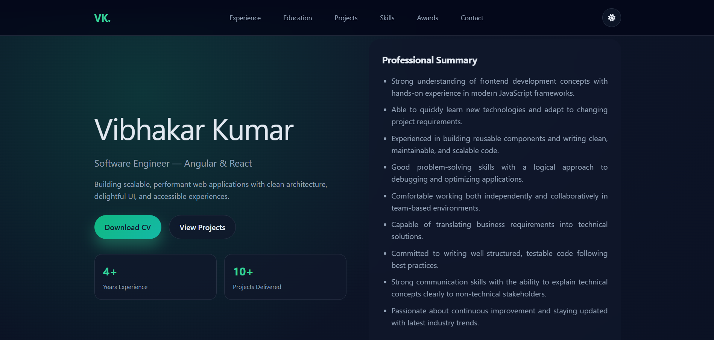

# Portfolio - Vibhakar

A modern, responsive personal portfolio built with Angular 22. It highlights projects, skills, education, experience, certifications, awards, and contact information with a clean, fast, zoneless UI.

## Sections

- Hero / Home (animated role rotator)
- Experience & Education (timeline)
- Projects (tech-stack filter)
- Skills (searchable, grouped)
- Certifications (category filter + search, `@defer`-loaded)
- Awards (`@defer`-loaded)
- Contact (reactive form + direct details, `@defer`-loaded)

## Tech Stack & Angular Features

- Angular 22 (standalone components, zoneless change detection)
- Signals for all component state (`signal`, `computed`)
- New control-flow syntax (`@if`, `@for`, `@empty`, `@defer`/`@placeholder`)
- Incremental hydration via `@defer (hydrate on viewport)` for below-the-fold sections
- Custom `appReveal` scroll-reveal directive and a signal-based `ScrollSpyService` for active-nav highlighting
- TypeScript, SCSS + Tailwind CSS, Font Awesome (standalone `FaIconComponent`)

## Content

All section content lives in dedicated `*.data.ts` files under
[src/app/core/data](src/app/core/data), so components stay presentation-only.

## Getting Started

Requires Node.js `>=22.22.3` (Angular 22's minimum).

1) Install dependencies: `npm install`
2) Run the app: `npm start`
3) Open `http://localhost:4200`

## Scripts

- `npm start` — start dev server
- `npm run build` — build production assets
- `npm run watch` — build in watch mode
- `npm test` — run unit tests
- `npm run serve:ssr:my-portfolio` — serve SSR build

## Project Structure

- [src/app/core/layout](src/app/core/layout) — header/footer layout
- [src/app/core/pages](src/app/core/pages) — page sections (hero, skills, projects, etc.)
- [src/app/core/data](src/app/core/data) — typed content for every section
- [src/app/core/directives](src/app/core/directives) — `appReveal` scroll-reveal directive
- [src/app/core/services](src/app/core/services) — shared services (theme, scroll-spy)
- [src/assets](src/assets) — static assets

## Customization

- Update content in the matching `*.data.ts` file under [src/app/core/data](src/app/core/data) — components read from these, so no template changes are needed for content edits.
- Adjust global styles in [src/styles.scss](src/styles.scss).
- Tailwind config: [tailwind.config.ts](tailwind.config.ts).

## Deployment

Deployed on GitHub Pages: https://iamvibhakar.github.io/portfolio_vibhakar

Build with `npm run build` and deploy the contents of `dist/`.

## License

Copyright © 2026 Vibhakar Kumar — https://www.linkedin.com/in/vibhakarkumar/
